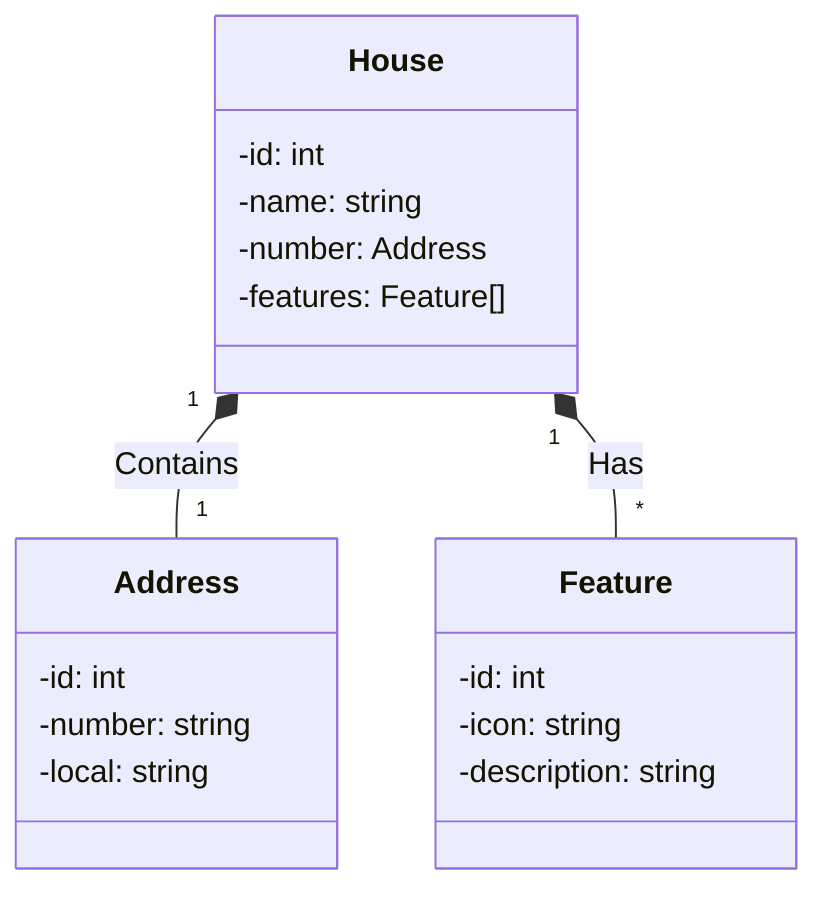

# Santander-Week-Projeto-Final
RESTfull API para Projeto de conclusão do SDW-2023.

## Diagrama de classes

```mermaid
classDiagram
    class House {
        -id: int
        -name: string
        -number: Address
        -features: Feature[]
    }
    
    class Address {
        -id: int
        -number: string
        -local: string
    }
    
    class Feature {
        -id: int
        -icon: string
        -description: string
    }
    
    House "1" *-- "1" Address: Contains
    House "1" *-- "*" Feature: Has
```
